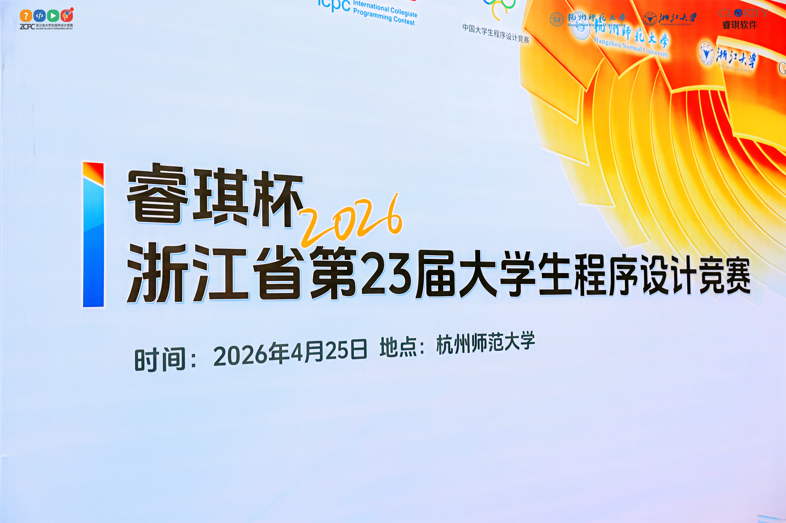
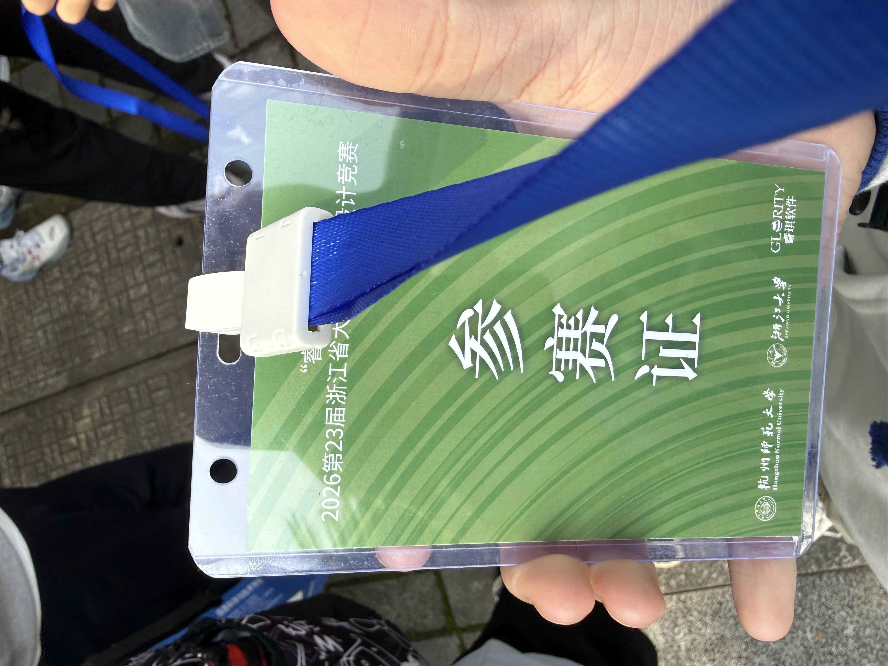
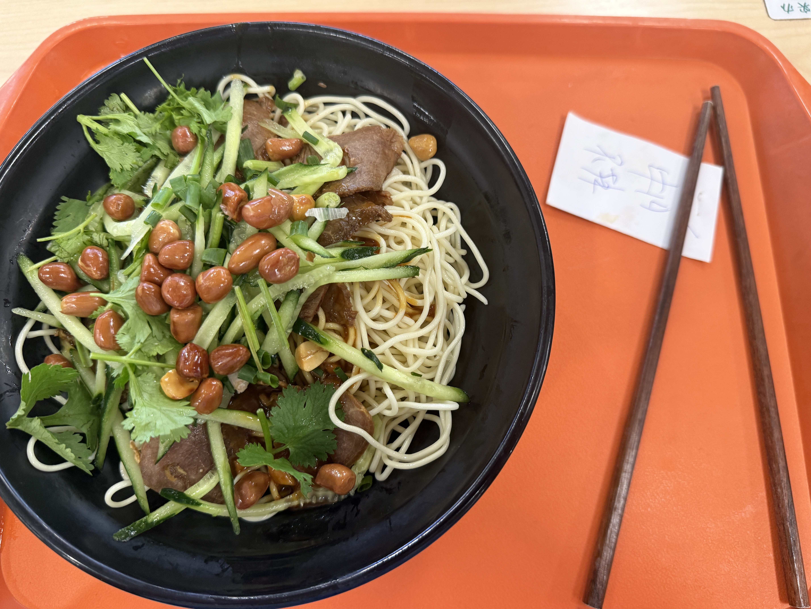

## 比赛信息

- 比赛时间：2026年4月25日
- 地点：杭州师范大学
- 主办单位：浙江省大学生
科技竞赛委员会
- 承办单位：杭州师范大学、浙江大学
## 关于行程
&emsp;&emsp;比赛当天，学校安排了校车从**安吉**（😭可怜的25级计算机去不了小和山校区）到**杭州师范大学**，车程约一个多小时。教练与小和山校区的同学先行抵达，并代领了衣服和参赛证。   

   

&emsp;&emsp;初见杭师大，感觉环境不错，校园很大，绿树成荫。比赛地点在**恕园16号楼**，由于出发时候的一点延迟，抵达的时候开幕式已经结束了，也几乎是最后一个拍照留念的学校了。   

&emsp;&emsp;拍完合照就匆匆去参加热身赛，调试机器。由于是第一次参加，有些许紧张，在调试时甚至将vscode的debug选成了gcc,导致无法运行C++的代码，幸好热身赛带了手机，能及时找到原因并改回了g++（但赛时因为电脑重启后，需要重新配置，然后因为忘记了**万恶的vscode编译时不能有中文路径** ，浪费了一点时间调整）。做了2道题后，监考老师开始赶人了，热身赛就这样结束了。   

&emsp;&emsp;由于杭师大真的很大，找食堂花了一点时间，食堂的人非常多，排队吃饭花了很长时间，同时也因为时间紧迫，选择了出餐快的凉面，味道还行，但物价相比安吉有点小贵,毕竟是杭州城区里。  

## 关于比赛
&emsp;&emsp;12点整比赛正式开始了。一人拆档案袋，一人打开提交页、调试编辑器。拿到试题，便开始寻找签到题，搞笑的是**J**题真的叫**签到题**。我**队友X**先去看了**J**，**队友H**在找数据量较小的题目，我快速翻阅，最后找到了**H**（ucup-team7610），一道字符串判断，简单解释题意后，**队友H**很快写完测完提交，14m拿下了第一题。然后在**H**题附近**I**，一道很有小巧思的题，寻找矩阵每列最小值之和的最大可能值（每行可自由变换），然后易得只要每行排序然后取最小即可。在29m时AC了第二题。  
&emsp;&emsp;当我感觉开局很顺利的时候，最后却高开低走，很难想象5小时内我们还是只过了签到的两题......**队友X**在**J**题上卡了很久，调试了很久，样例不能完全通过。**队友H**在解**L**时，因为审题失误，在最后1h时已经来不及调试了。同时中途也因为devcpp不支持结构化绑定，而我们准备有点不充分，没有特意去记忆C++14下的写法。故我们选择去vscode调试，但因为过于紧张，使用了中文名的文件夹，导致无法编译，浪费了不少时间。不过好在，我们在10分钟左右反应过来了，让**队友H**得以继续调试。而我在这期间，一直在思考**G**，一道构造题，但一直没有什么头绪，一开始的取模也不能完全覆盖所有情况。就这样，5个小时，带着遗憾结束了第一次正赛。  
&emsp;&emsp;赛后，和队友们一起吃了个饭，聊了聊比赛，感觉收获还是挺大的。至少超过了平时VP时的成绩，也获得了宝贵的竞赛经验。希望下次能有更好的表现！  

## 总结
&emsp;&emsp;总的来说，这次比赛让我学到了很多东西。首先是**赛前准备的重要性**，虽然我们在赛前做了一些准备，但还是有一些细节没有考虑到，比如编译环境的配置和文件路径的问题，这些都在比赛中暴露出来了。其次是**团队合作的重要性**，虽然我们在比赛中遇到了一些困难，但我们还是能够互相支持和帮助，这也是我们能够完成比赛的原因之一。最后是**心态调整的重要性**，比赛中难免会遇到挫折和失败，但重要的是要保持积极的心态，从失败中吸取教训，不断改进自己。希望在未来的比赛中，我们能够继续努力，取得更好的成绩！AC More!   

---

*最后更新：2026年5月3日*

